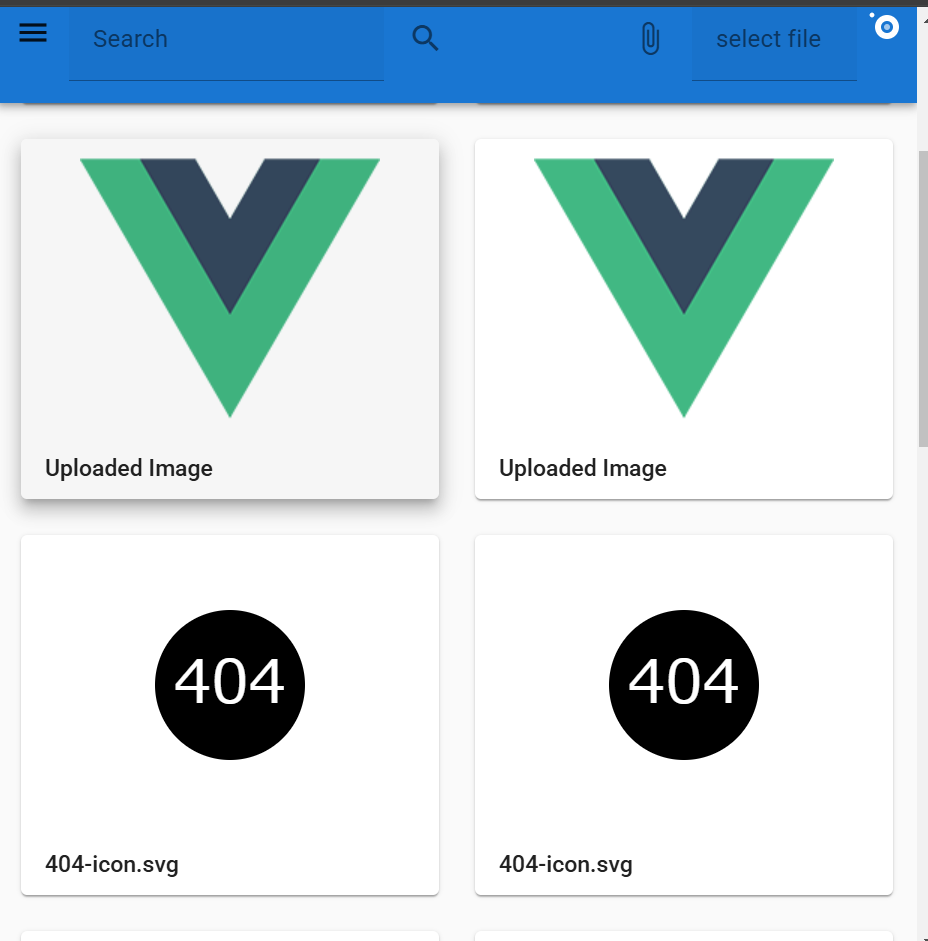
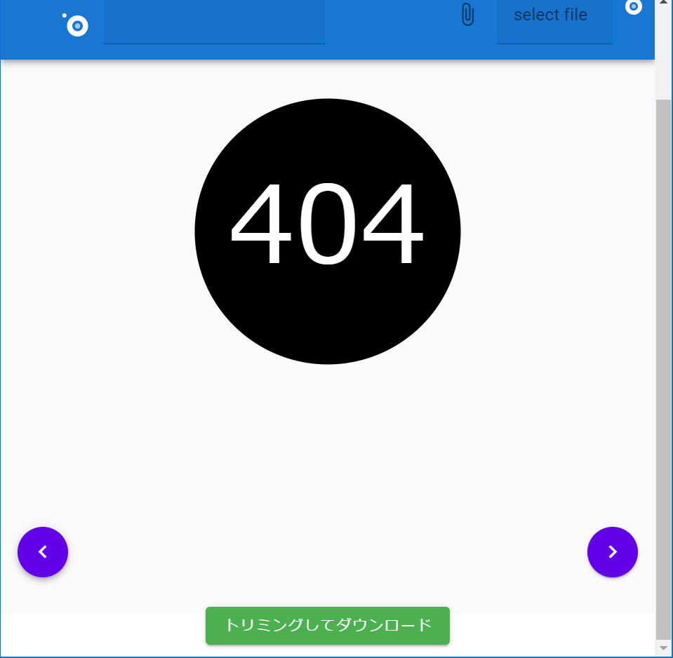
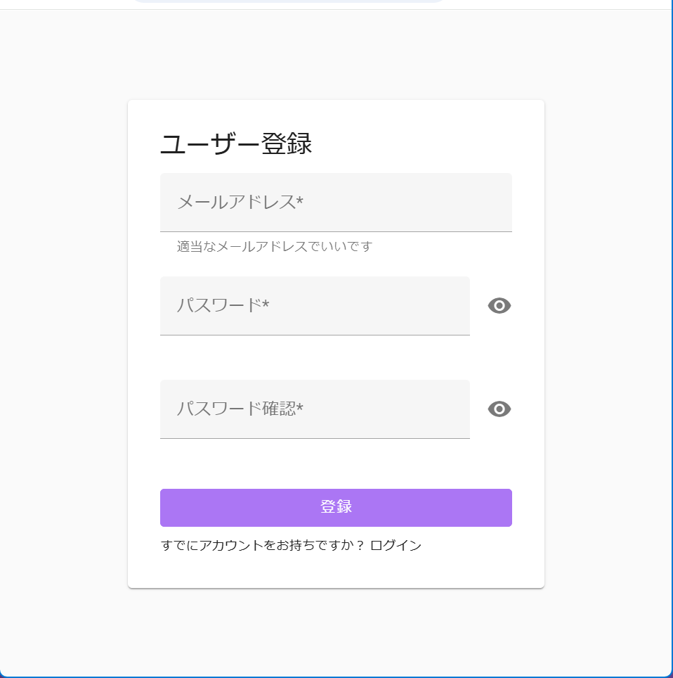
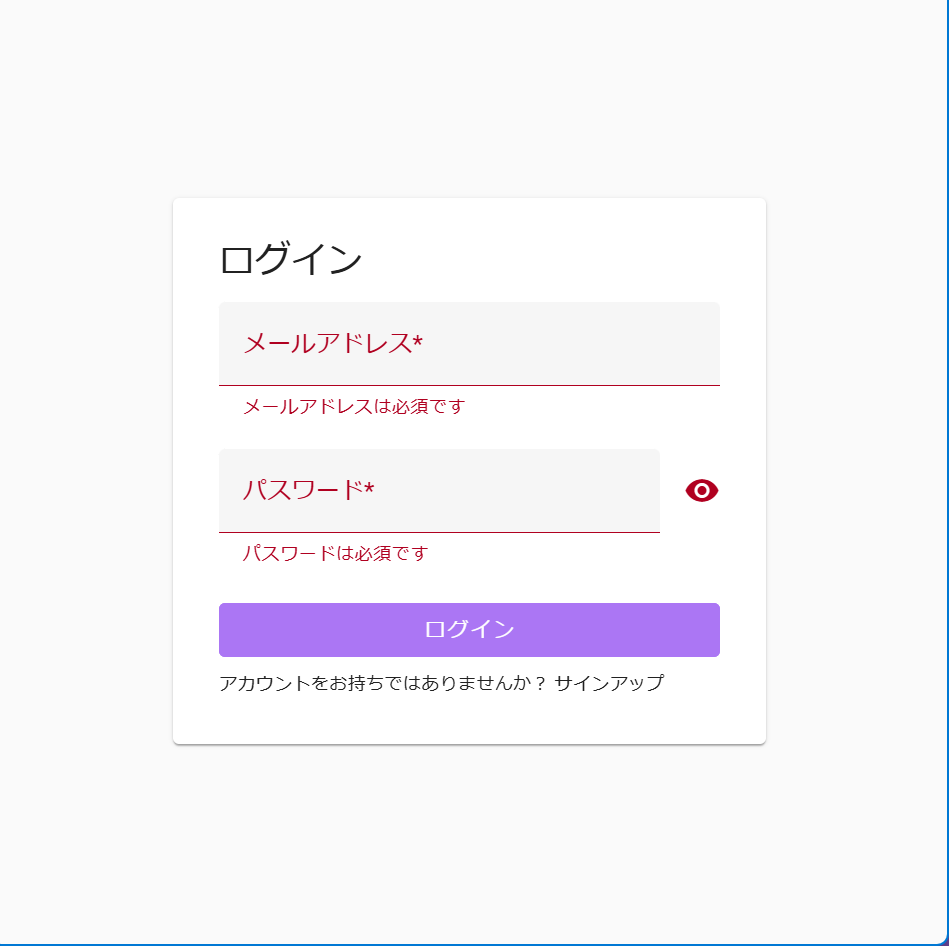
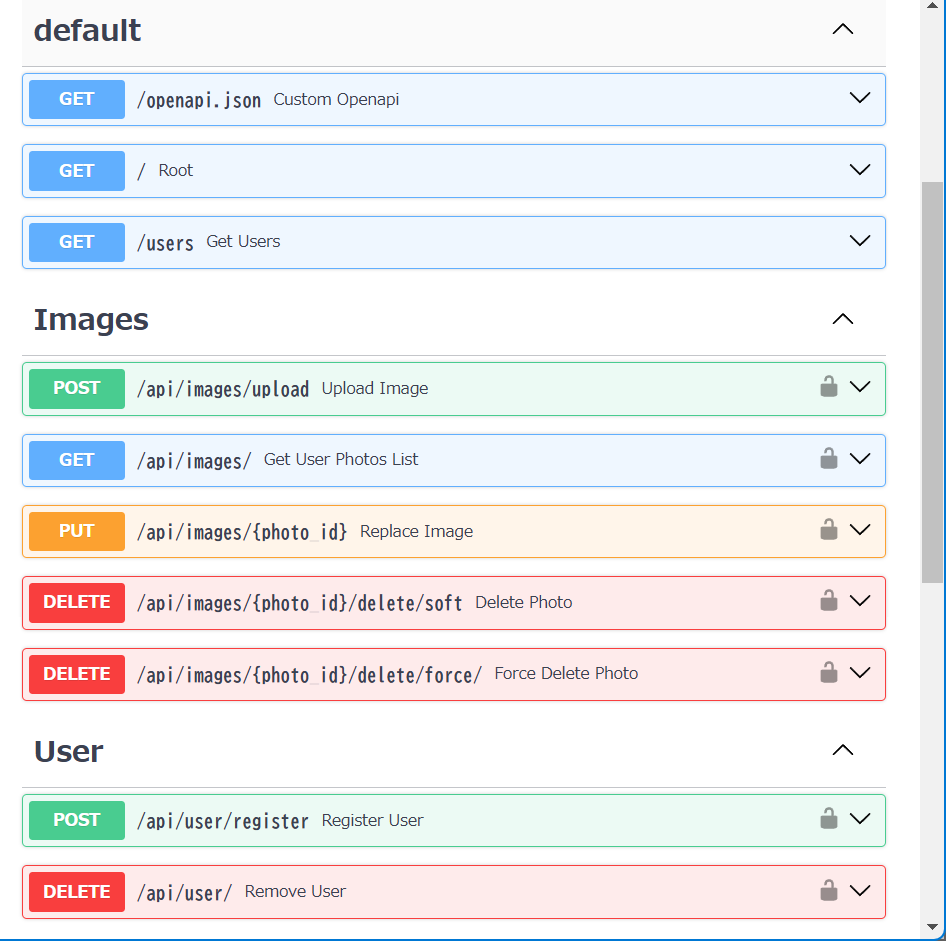

# photo_app

FirebaseAuthとCloudinaryを使い、認証機能を持つだけの画像アプリです。Vue.jsとFastAPIを学習して一か月未満の頃に、これらのフレームワークや外部サービスとの連携の練習を兼ねて一週間ほどで適当に作っただけのアプリです。

~~まだ作りかけで、一部の機能しか実装できていません。(一応API自体はある程度書きましたが・・・) あくまで練習用のアプリなので、今後このアプリの開発に時間を割くことはないと思います。~~

また、フロントエンドはFirebase hosting、バックエンドはHerokuにデプロイ予定ですが、まだ出来ていません・・・。


</br>


### 利用手順

#### サーバーの起動

1. PythonとPoetryのインストール

```bash
curl -sSL https://install.python-poetry.org | python3 -
```

2. ライブラリのインストール

```bash
poetry install
```

3. 環境変数ファイルの設定

ここでは、CloudinaryやRDBの設定を行います。

```bash
cp .env.example .env
```

4. DBのマイグレーションの実行

```bash
poetry run task migrate
```

5. サーバーの起動
```bash
poetry run task serve
```

#### フロントエンドの起動

1. ライブラリのインストール

```bash
npm install
```

2. 環境変数ファイルの設定

ここでは、Firebaseの設定を行います。

```bash
cp .env.example .env
```

3. Vueの起動

```bash
npm run serve
```

### 機能

#### フロントエンド

フロントエンドはTS + Vue.js + Vuetifyを使いました。また、グローバル状態管理はpinia、ルーティングはvue router、画像表示はcropper.jsを使いました。

今までは認証機能はバックエンド側でJWTを使って簡易的に実装しており、FirebaseAuthやCognito + Amplifyのようにフロントエンド中心で実装したことがなかったため、アクセストークンやリフレッシュトークンの管理に少し手間取りました。

以下は実装した機能の例です。
- firebaseAuthを使ったバリデーション付きのユーザー登録、ログイン画面
- ログイン成功・失敗時、画像アップロード時のフラッシュメッセージ
- デバイスの状態に応じてダークモード切替


</br>


#### バックエンド

バックエンドはPython + FastAPIです。PythonはFlaskを以前少し触った程度でしたが、非同期処理中心で、OASを自動生成でき、型も本格的に活用するFastAPIというフレームワークを今更知ったのでこの機会に学習してみました。poetry、httpx、taskipy、typingなどのモダンなライブラリも全く知らなかったので勉強になりました。

以下は実装した機能の例です。
- firebase-adminを使い、トークンをもとにユーザーを識別する認可機能
- トークンを元に、DBにもユーザーを登録する機能
- 画像データをもとに、DBにメタデータを保存する機能
- 論理削除、物理削除API (フロントエンドは未実装)



#### データベース

開発段階では簡易的にSQLite、本番環境ではHerokuを使うので必然的にPostgreSQLを使う予定です。RDBはMySQLしか使ったことがありませんが、Herokuが大体の設定をしてくれるのであまり問題はないかと思います。

また、ORMはTortoiseORMを使いました。当初はNode.js環境で慣れているPrismaORMを使うことも考えましたが、せっかくなので非同期処理中心のTortoiseORMを覚えてみました。

#### 感想

まだ途中ですが、Vue.jsやPython(FastAPI)の文法やエコシステムの理解を多少深めることができました。特に、OASは今までStoplightなどを使って自分で書いていたので、自動生成してくれるフレームワークは非常に便利だと感じました。そのうちホスティングサービスにデプロイし、完成させたいと思います。